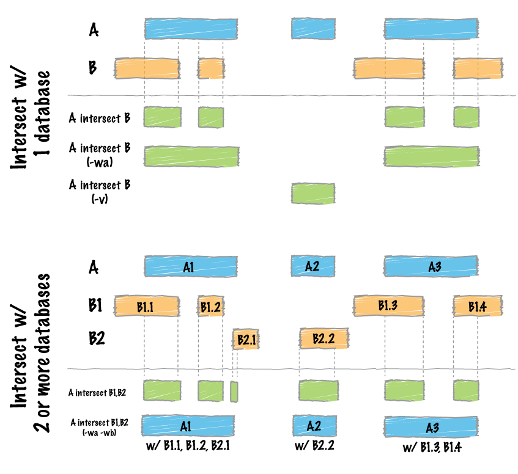

## Intersect: the workhorse of `bedtools`

One of the most important arithmetic operation performed on genomic
coordinates is `intersect`, which identifies which regions in **A**
are found in **B**. The figure below (taken from
[http://quinlanlab.org/tutorials/bedtools/bedtools.html]) illustrates
the `intersect` between 2 or more files. 

To find out what the options are for `intersect`, simply issue the
following on the command line: 

~~~
bedtools intersect -h 
~~~
{: .bash}

This will print an exhaustive list of options that can be provided
when running `intersect`. 

> ## Try it
>
> Using `intersect`, find out the which CpG islands (coordinates are
> provided in cpg.bed) are located within exons (coordinates provided
> in exons.bed).
>
>
{: .challenge}

## Reporting options
By default, `intersect` reports the intervals which is common to the
files. However, we are occassionally interested in knowing not just
the coordinates, but also the features that are overlapping. This can
be specified using the `-w` options (`-wa`, `wb`). 

> ## Try it
> 
> How do we find out which CpG islands are located in which exon? 
> 
{: .challenge}

> ## Find out
>
> What does the option `-wo` report, in addition to the features that
> overlap between both set of coordinates?
>
{: .challenge}

If we are interested in knowing how many features in **B** does a
feature in **A** overlap, we can use `-c`, which tells us for each
feature in **A** how many regions in **B** does it overlap. 

## Finding the regions that do not overlap
`intersect` returns us intervals that are overlapping in both
files. However, if we are interested in identifying which intervals in
**A** do not overlap with any intervals in  **B**, we can specify `-v`
to do so. That is:

~~~
bedtools intersect -a cpg.bed -b exons.bed -v
~~~
{: .bash}

The command above will tell us which CpG islands are not located
within any exon. 

## Finding the complement of a set of intervals
Another useful tool is `complement`, which tells us which regions of the **genome** is not covered by the intervals represented in our *bed* file. In order to use `complement`, we need to provide a genome file, which tells *bedtools* how many bases are there in each chromosome.

> ## Difference between `complement` and `intersect -v`
>
> What is the difference between `complement` and `intersect -v`?
>
{: .challenge}