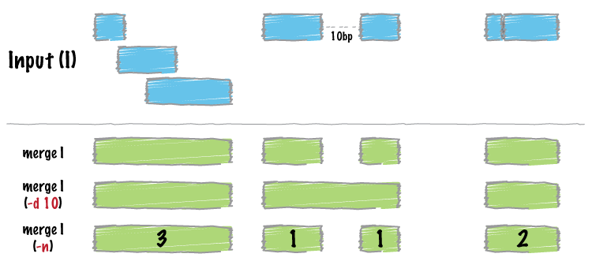

## Why do we need to merge? 
Sometimes, we obtain regions that show overlaps that can be collapsed
into a single contiguous interval. By merging these regions, we are
able to recover a single continuous region, which simplifies our
analysis. This is shown in the figure below. *Bedtools* enables this operation to be done using `merge`,
which we will discuss next. 

## Using `merge`

> ## Requisite for merging
>
> Unlike `intersect` which does not strictly require the input to be
> sorted, `merge` requires that the input file provided is
> sorted. This can be done using a simple command `sort` that is
> provided in bash, as follows:  `sort -k1,1 -k2,2n foo.bed >
> foo.sort.bed` will sort the bed file and have it written to
> foo.sort.bed
{: .challenge}

As usual, one can find out the list of options using 

~~~
bedtools merge -h
~~~
{: .bash} 

